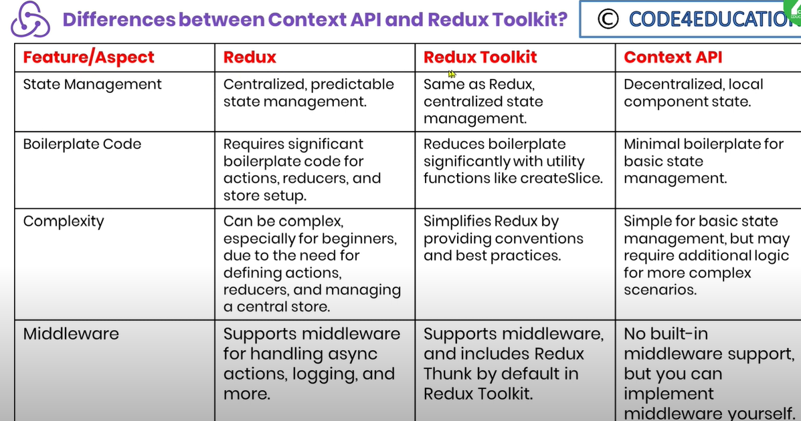
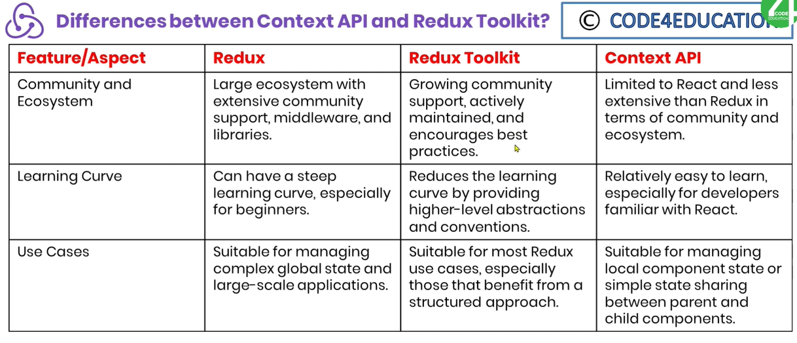

- Redux Toolkit:
    - It is a library and set conventions for simplifying the management of state in JavaScript applications using Redux.
    - It is developed by Redux team to address some challenges and complexities attached with setting up and maintaining Redux in a project.

- Primary Use Cases:
    - Boilerplate Reduction: 
        - Redux toolkit significantly reduces the amount of boilerplate code which we need to write when setting up and working with Redux. 
        - This makes Redux more accessible and less complex for developers.

    - Simplified Store Configuration:
        - Redux toolkit provides configureStore function which simplifies store setup process.
        - It function includes the following sensible defaults for middleware so that we do not need to configure them manually. 
            - Redux Thunk
            - Redux DevTools Extension

    - Reducer with CreateSlice:
        - Redux toolkit provides createSlice function which is a utility function that helps us to define Reducers more concisely and with less code.
        - It encapsulates the reducer logic, action creators and initial state in a single place.

    - Immutability:
        - Redux toolkit uses Immer library under the hood to handle immutability bu allows us to write the immutable code with our Reducers while ensuring immutability in practice.
        - This makes it easier to update state in a more intuitive/easy and readable way.

    - Action Creators:
        - It automatically generates action creators for each slice created using createSlice function. 
        - This action creators eliminate the need to write explicit action types and action creator functions manually.

    - Redux DevTools Integration:
        - Redux toolkit integrates with Redux DevTools Extension making it easy to inspect and debug the state changes and actions of our application.

    - Redux Thunks:
        - Redux toolkit simplifies the use of Thunks for handling asynchronous actions by including Redux Thunk as a default middleware.
        - This allows us to write asynchronous logic with our action creators in a more easily and readable way.

    - Selectors:
        - Redux toolkit provides createSelector utility that simplifies the process of selecting data from Redux store.
        - This can help us to avoid redundant calculations and improve the performance of the application.

    - Immutable Update Patterns:
        - It encourages to use of immutable update patterns like immer.js or Immer library to update state which helps prevent unexpected side effects and simplifies debugging.

    - Official Recommendation:
        - Redux toolkit is officially recommended by Redux team as the preferred way to write Redux code.

- Difference between Redux Toolkit and Redux and Context API:
    - Redux:
    - Redux Toolkit:
    - Context API:

    - Screenshot:
        - 
        - 
    